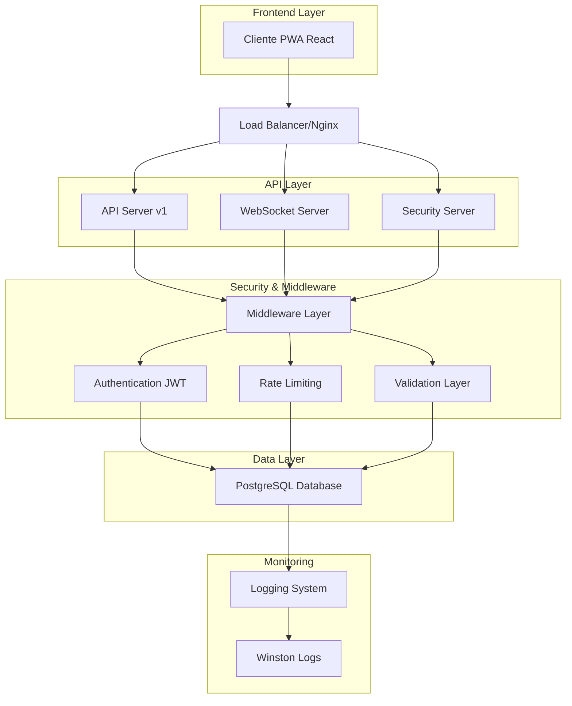
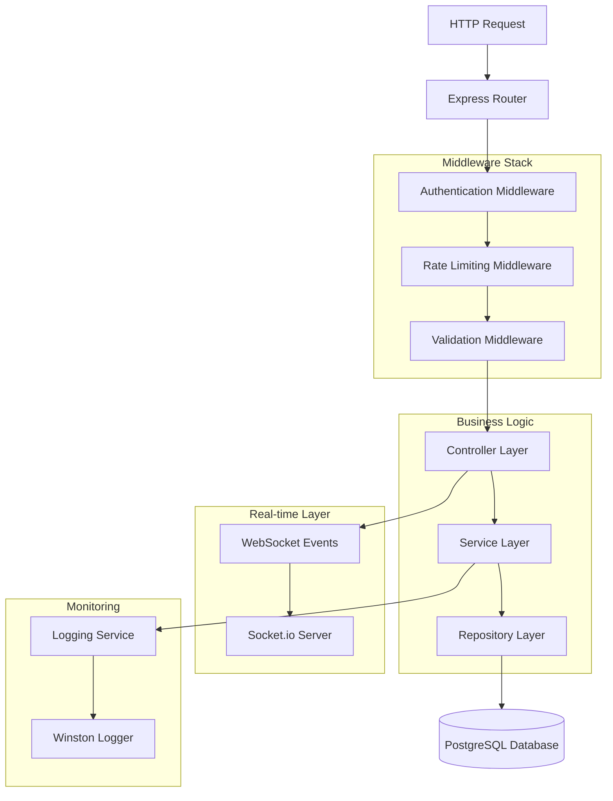
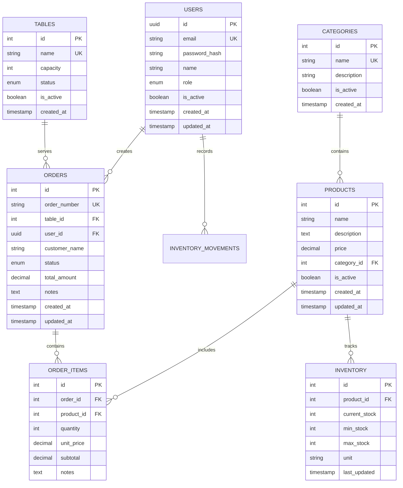

# 🏗️ ARQUITECTURA TÉCNICA - PROYECTO PAMBAZO 2.1

## 1. Arquitectura General del Sistema

### Diagrama de Arquitectura


## 2. Descripción de Tecnologías

### Frontend Stack
- **React 18** - Framework principal con hooks modernos
- **TypeScript** - Tipado estático para mayor robustez
- **Tailwind CSS** - Framework de estilos utility-first
- **Vite** - Build tool rápido y moderno
- **PWA** - Progressive Web App con service workers
- **Zustand** - Estado global ligero y eficiente

### Backend Stack
- **Node.js 18+** - Runtime de JavaScript
- **Express.js 4** - Framework web minimalista
- **Socket.io 4** - WebSockets para tiempo real
- **PostgreSQL** - Base de datos relacional
- **JWT** - Autenticación basada en tokens
- **Winston** - Sistema de logging estructurado

### Seguridad y Middleware
- **Helmet.js** - Headers de seguridad HTTP
- **CORS** - Control de acceso entre dominios
- **Express Rate Limit** - Limitación de requests
- **Joi** - Validación de esquemas
- **bcrypt** - Hashing de contraseñas
- **XSS Protection** - Protección contra ataques XSS

## 3. Definición de Rutas Frontend

| Ruta | Propósito | Componente | Autenticación |
|------|-----------|------------|---------------|
| `/` | Página principal | `HomePage` | No |
| `/login` | Inicio de sesión | `LoginPage` | No |
| `/dashboard` | Panel principal | `Dashboard` | Sí |
| `/admin` | Panel administrativo | `AdminDashboard` | Admin |
| `/kitchen` | Panel de cocina | `KitchenDashboard` | Kitchen |
| `/waiter` | Panel de mesero | `WaiterDashboard` | Waiter |
| `/products` | Gestión de productos | `ProductManagement` | Admin |
| `/orders` | Gestión de órdenes | `OrderManagement` | Sí |
| `/inventory` | Control de inventario | `InventoryManagement` | Admin |
| `/tables` | Gestión de mesas | `TableManagement` | Waiter+ |
| `/reports` | Reportes y analytics | `ReportsPage` | Admin |

## 4. Definiciones de API

### 4.1 Autenticación

#### Login de Usuario
```
POST /api/v1/auth/login
```

**Request:**
| Parámetro | Tipo | Requerido | Descripción |
|-----------|------|-----------|-------------|
| email | string | true | Email del usuario |
| password | string | true | Contraseña en texto plano |

**Response:**
| Parámetro | Tipo | Descripción |
|-----------|------|-------------|
| success | boolean | Estado de la operación |
| token | string | JWT token para autenticación |
| user | object | Datos del usuario autenticado |

**Ejemplo:**
```json
{
  "success": true,
  "token": "eyJhbGciOiJIUzI1NiIsInR5cCI6IkpXVCJ9...",
  "user": {
    "id": 1,
    "email": "admin@pambazo.com",
    "name": "Administrador",
    "role": "owner"
  }
}
```

#### Obtener Usuario Actual
```
GET /api/v1/auth/me
```

**Headers:**
```
Authorization: Bearer <jwt_token>
```

**Response:**
```json
{
  "success": true,
  "user": {
    "id": 1,
    "email": "admin@pambazo.com",
    "name": "Administrador",
    "role": "owner",
    "created_at": "2025-01-01T00:00:00Z"
  }
}
```

### 4.2 Gestión de Productos

#### Listar Productos
```
GET /api/v1/products
```

**Query Parameters:**
| Parámetro | Tipo | Descripción |
|-----------|------|-------------|
| page | number | Número de página (default: 1) |
| limit | number | Elementos por página (default: 10) |
| search | string | Búsqueda por nombre |
| category_id | number | Filtrar por categoría |
| is_active | boolean | Filtrar por estado activo |

**Response:**
```json
{
  "success": true,
  "data": [
    {
      "id": 1,
      "name": "Pambazo Tradicional",
      "description": "Pambazo clásico con chorizo y papa",
      "price": 45.00,
      "category_id": 1,
      "category_name": "Pambazos",
      "is_active": true,
      "created_at": "2025-01-01T00:00:00Z"
    }
  ],
  "pagination": {
    "page": 1,
    "limit": 10,
    "total": 40,
    "pages": 4
  }
}
```

#### Crear Producto
```
POST /api/v1/products
```

**Request:**
```json
{
  "name": "Pambazo Especial",
  "description": "Pambazo con ingredientes premium",
  "price": 65.00,
  "category_id": 1,
  "is_active": true
}
```

### 4.3 Gestión de Órdenes

#### Crear Orden
```
POST /api/v1/orders
```

**Request:**
```json
{
  "table_id": 5,
  "customer_name": "Juan Pérez",
  "items": [
    {
      "product_id": 1,
      "quantity": 2,
      "unit_price": 45.00,
      "notes": "Sin cebolla"
    },
    {
      "product_id": 3,
      "quantity": 1,
      "unit_price": 25.00
    }
  ],
  "notes": "Para llevar"
}
```

**Response:**
```json
{
  "success": true,
  "data": {
    "id": 123,
    "order_number": "ORD-2025-001",
    "table_id": 5,
    "customer_name": "Juan Pérez",
    "status": "pending",
    "total_amount": 115.00,
    "created_at": "2025-01-01T12:00:00Z",
    "items": [...]
  }
}
```

### 4.4 Gestión de Inventario

#### Actualizar Stock
```
PUT /api/v1/inventory/:id
```

**Request:**
```json
{
  "current_stock": 50,
  "min_stock": 10,
  "max_stock": 100,
  "unit": "kg",
  "notes": "Restock realizado"
}
```

## 5. Arquitectura del Servidor

### Diagrama de Capas del Servidor


### Estructura de Middleware
```javascript
// Orden de middleware en Express
app.use(helmet()); // Seguridad headers
app.use(cors()); // CORS policy
app.use(compression()); // Compresión gzip
app.use(express.json()); // Parser JSON
app.use(rateLimiter); // Rate limiting
app.use(authMiddleware); // Autenticación JWT
app.use(validationMiddleware); // Validación Joi
app.use('/api/v1', routes); // Rutas de API
```

## 6. Modelo de Datos

### 6.1 Diagrama Entidad-Relación


### 6.2 Scripts de Creación de Tablas

#### Tabla de Usuarios
```sql
-- Crear tabla de usuarios
CREATE TABLE users (
    id UUID PRIMARY KEY DEFAULT gen_random_uuid(),
    email VARCHAR(255) UNIQUE NOT NULL,
    password_hash VARCHAR(255) NOT NULL,
    name VARCHAR(100) NOT NULL,
    role VARCHAR(20) DEFAULT 'employee' CHECK (role IN ('owner', 'admin', 'kitchen', 'waiter', 'employee')),
    is_active BOOLEAN DEFAULT true,
    created_at TIMESTAMP WITH TIME ZONE DEFAULT NOW(),
    updated_at TIMESTAMP WITH TIME ZONE DEFAULT NOW()
);

-- Índices para optimización
CREATE INDEX idx_users_email ON users(email);
CREATE INDEX idx_users_role ON users(role);
CREATE INDEX idx_users_active ON users(is_active);
```

#### Tabla de Productos
```sql
-- Crear tabla de productos
CREATE TABLE products (
    id SERIAL PRIMARY KEY,
    name VARCHAR(255) NOT NULL,
    description TEXT,
    price DECIMAL(10,2) NOT NULL CHECK (price >= 0),
    category_id INTEGER REFERENCES categories(id),
    is_active BOOLEAN DEFAULT true,
    created_at TIMESTAMP WITH TIME ZONE DEFAULT NOW(),
    updated_at TIMESTAMP WITH TIME ZONE DEFAULT NOW()
);

-- Índices para optimización
CREATE INDEX idx_products_category ON products(category_id);
CREATE INDEX idx_products_active ON products(is_active);
CREATE INDEX idx_products_name ON products(name);
```

#### Tabla de Órdenes
```sql
-- Crear tabla de órdenes
CREATE TABLE orders (
    id SERIAL PRIMARY KEY,
    order_number VARCHAR(50) UNIQUE NOT NULL,
    table_id INTEGER REFERENCES tables(id),
    user_id UUID REFERENCES users(id),
    customer_name VARCHAR(255),
    status VARCHAR(20) DEFAULT 'pending' CHECK (status IN ('pending', 'preparing', 'ready', 'served', 'cancelled')),
    total_amount DECIMAL(10,2) DEFAULT 0 CHECK (total_amount >= 0),
    notes TEXT,
    created_at TIMESTAMP WITH TIME ZONE DEFAULT NOW(),
    updated_at TIMESTAMP WITH TIME ZONE DEFAULT NOW()
);

-- Índices para optimización
CREATE INDEX idx_orders_status ON orders(status);
CREATE INDEX idx_orders_table ON orders(table_id);
CREATE INDEX idx_orders_user ON orders(user_id);
CREATE INDEX idx_orders_created ON orders(created_at DESC);
```

### 6.3 Datos Iniciales

#### Usuario Administrador
```sql
-- Insertar usuario owner por defecto
INSERT INTO users (email, password_hash, name, role) VALUES 
('admin@pambazo.com', '$2b$10$hashed_password', 'Administrador Principal', 'owner');
```

#### Categorías Básicas
```sql
-- Insertar categorías iniciales
INSERT INTO categories (name, description) VALUES 
('Pambazos', 'Pambazos tradicionales y especiales'),
('Bebidas', 'Refrescos, aguas y bebidas calientes'),
('Postres', 'Postres y dulces tradicionales'),
('Antojitos', 'Quesadillas, sopes y otros antojitos');
```

#### Productos de Ejemplo
```sql
-- Insertar productos de ejemplo
INSERT INTO products (name, description, price, category_id) VALUES 
('Pambazo Tradicional', 'Pambazo con chorizo y papa', 45.00, 1),
('Pambazo Especial', 'Pambazo con chorizo, papa y queso', 55.00, 1),
('Coca Cola', 'Refresco de cola 355ml', 25.00, 2),
('Agua Natural', 'Agua purificada 500ml', 15.00, 2);
```

## 7. Configuración de Seguridad

### Headers de Seguridad (Helmet.js)
```javascript
app.use(helmet({
  contentSecurityPolicy: {
    directives: {
      defaultSrc: ["'self'"],
      styleSrc: ["'self'", "'unsafe-inline'"],
      scriptSrc: ["'self'"],
      imgSrc: ["'self'", "data:", "https:"],
    },
  },
  hsts: {
    maxAge: 31536000,
    includeSubDomains: true,
    preload: true
  }
}));
```

### Rate Limiting
```javascript
const rateLimiter = rateLimit({
  windowMs: 15 * 60 * 1000, // 15 minutos
  max: 100, // máximo 100 requests por ventana
  message: {
    error: 'Demasiadas solicitudes, intenta más tarde'
  },
  standardHeaders: true,
  legacyHeaders: false,
});
```

### Validación con Joi
```javascript
const productSchema = Joi.object({
  name: Joi.string().min(3).max(255).required(),
  description: Joi.string().max(1000),
  price: Joi.number().positive().precision(2).required(),
  category_id: Joi.number().integer().positive().required(),
  is_active: Joi.boolean().default(true)
});
```

## 8. Configuración de WebSockets

### Eventos del Sistema
```javascript
// Eventos de conexión
socket.on('connect', () => {
  console.log('Cliente conectado:', socket.id);
});

// Eventos de órdenes
socket.on('order:create', (orderData) => {
  // Crear orden y notificar a cocina
  io.to('kitchen').emit('order:new', orderData);
});

// Eventos de inventario
socket.on('inventory:update', (inventoryData) => {
  // Actualizar inventario y verificar stock bajo
  if (inventoryData.current_stock <= inventoryData.min_stock) {
    io.to('admin').emit('inventory:low_stock', inventoryData);
  }
});
```

### Salas por Roles
```javascript
// Unir usuario a sala según su rol
socket.on('user:join', (userData) => {
  socket.join(userData.role);
  socket.join(`user:${userData.id}`);
  
  // Notificar conexión a administradores
  socket.to('admin').emit('user:connected', {
    id: userData.id,
    name: userData.name,
    role: userData.role
  });
});
```

---

*Documento técnico generado para el proyecto PAMBAZO 2.1 - Sistema de gestión para restaurante*