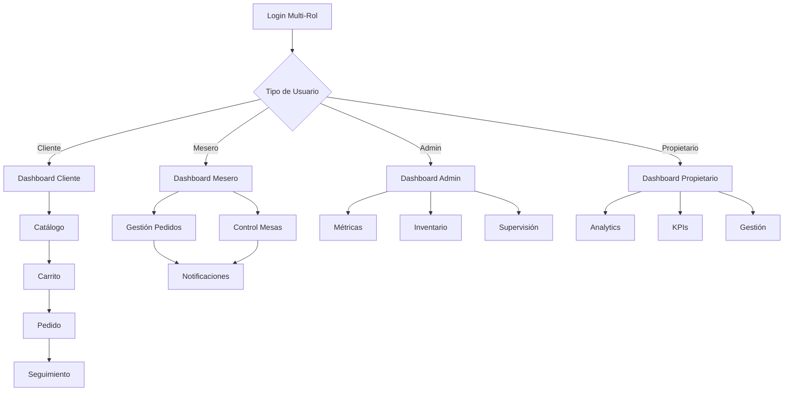

# 🥖 PAMBAZO - Documento de Requerimientos de Producto

## 1. Visión General del Producto

PAMBAZO es una aplicación PWA (Progressive Web App) completa para la gestión integral de panaderías, diseñada con un sistema multi-rol inteligente que detecta automáticamente el tipo de dispositivo y proporciona interfaces optimizadas tanto para desktop como para móvil. La aplicación permite gestionar todas las operaciones de una panadería desde la experiencia del cliente hasta el análisis ejecutivo del propietario.

**Objetivo Principal**: Digitalizar completamente las operaciones de una panadería proporcionando herramientas específicas para cada rol operativo, optimizando la experiencia del usuario y maximizando la eficiencia operativa.

**Valor de Mercado**: Solución integral que elimina la necesidad de múltiples sistemas separados, reduciendo costos operativos y mejorando la experiencia del cliente a través de tecnología PWA moderna.

## 2. Características Principales

### 2.1 Roles de Usuario

| Rol | Método de Registro | Permisos Principales |
|-----|-------------------|---------------------|
| Cliente | Registro por email/teléfono | Navegar catálogo, realizar pedidos, ver historial |
| Mesero | Asignación por administrador | Gestionar pedidos, controlar mesas, actualizar estados |
| Administrador | Credenciales del sistema | Supervisar operaciones, gestionar inventario, controlar personal |
| Propietario | Acceso ejecutivo | Analytics completos, configuración del sistema, gestión financiera |

### 2.2 Módulos de Funcionalidad

Nuestra aplicación PAMBAZO consta de las siguientes páginas principales:

1. **Página de Login**: Autenticación multi-rol con detección de dispositivo
2. **Dashboard Cliente**: Catálogo interactivo, carrito inteligente, sistema de pedidos
3. **Dashboard Mesero**: Gestión de pedidos, control de mesas, menú interactivo
4. **Dashboard Administrador**: Control operativo, gestión de inventario, supervisión
5. **Dashboard Propietario**: Analytics ejecutivo, KPIs avanzados, centro de gestión
6. **Versiones Móviles**: Interfaces optimizadas para cada rol con navegación nativa

### 2.3 Detalles de Páginas

| Página | Módulo | Descripción de Funcionalidad |
|--------|--------|------------------------------|
| Login | Autenticación Multi-Rol | Detectar dispositivo, validar credenciales, redirigir según rol y tipo de dispositivo |
| Cliente Desktop | Catálogo Principal | Mostrar productos por categorías, filtros avanzados, sistema de búsqueda, ratings y descripciones |
| Cliente Desktop | Carrito de Compras | Gestión de cantidades, cálculo de totales, persistencia de sesión, opciones de entrega |
| Cliente Desktop | Sistema de Pedidos | Formularios de dirección, métodos de pago, notas especiales, confirmación de pedido |
| Cliente Desktop | Historial de Pedidos | Lista de pedidos anteriores, estados en tiempo real, detalles completos, seguimiento |
| Cliente Móvil | Catálogo Móvil | Vista grid optimizada, categorías deslizables, sheet deslizante para carrito |
| Cliente Móvil | Navegación Móvil | Bottom navigation, gestos swipe, header contextual, safe area support |
| Mesero Desktop | Gestión de Pedidos | Crear pedidos, asignar mesas, controlar estados, recibir notificaciones |
| Mesero Desktop | Control de Mesas | Vista grid 2x4, estados de mesa, timer de ocupación, asignación de meseros |
| Mesero Desktop | Menú Interactivo | Visualización completa, indicadores de disponibilidad, precios actualizados |
| Mesero Móvil | Gestión Móvil | Interface táctil optimizada, notificaciones push, controles de fácil acceso |
| Admin Desktop | Dashboard de Control | Métricas del día, resumen operativo, indicadores de rendimiento |
| Admin Desktop | Gestión de Inventario | Control de stock, alertas automáticas, barras de progreso, reabastecimiento |
| Admin Desktop | Supervisión de Pedidos | Vista de pedidos activos, control de tiempos, asignación de personal |
| Admin Móvil | Control Móvil | Dashboard compacto, alertas prioritarias, acceso rápido a funciones críticas |
| Propietario Desktop | Dashboard Ejecutivo | KPIs avanzados, filtros temporales, comparativas, métricas de crecimiento |
| Propietario Desktop | Analytics Avanzado | Rankings de productos, análisis de equipo, métricas de satisfacción |
| Propietario Desktop | Centro de Gestión | Configuración del sistema, gestión de personal, configuración de precios |
| Propietario Móvil | Analytics Móvil | KPIs esenciales, alertas ejecutivas, acceso a reportes principales |
| PWA Global | Instalación Nativa | Manifest completo, service worker, shortcuts, modo standalone |
| PWA Global | Características Avanzadas | Caching estratégico, notificaciones push, sincronización offline |

## 3. Flujos Principales

### Flujo del Cliente
El cliente accede a la aplicación, navega por el catálogo de productos organizados por categorías, agrega items al carrito con gestión de cantidades, selecciona método de entrega (recoger/domicilio), completa información de pago y dirección si es necesario, confirma el pedido y puede hacer seguimiento en tiempo real del estado.

### Flujo del Mesero
El mesero se autentica en el sistema, visualiza el estado de todas las mesas en un grid 2x4, recibe notificaciones de nuevos pedidos, asigna pedidos a mesas específicas, actualiza estados de preparación, gestiona la ocupación de mesas y controla tiempos de servicio.

### Flujo del Administrador
El administrador accede al dashboard de control, revisa métricas operativas del día, supervisa el inventario con alertas de stock bajo, gestiona pedidos activos asignando personal, controla el estado de las mesas y mantiene la operación funcionando eficientemente.

### Flujo del Propietario
El propietario accede a analytics ejecutivos, revisa KPIs con filtros temporales, analiza tendencias y comparativas, gestiona configuraciones del sistema, supervisa el rendimiento del equipo y toma decisiones estratégicas basadas en datos.



## 4. Diseño de Interfaz de Usuario

### 4.1 Estilo de Diseño

- **Colores Primarios**: 
  - Primario: #D97706 (Naranja panadería)
  - Secundario: #92400E (Marrón cálido)
  - Acento: #F59E0B (Amarillo dorado)
- **Estilo de Botones**: Redondeados con radius de 8px, efectos hover suaves, estados activos claramente definidos
- **Tipografía**: 
  - Fuente principal: Inter (sistema)
  - Tamaños: 12px (caption), 14px (body), 16px (subtitle), 20px (title), 24px+ (headers)
- **Estilo de Layout**: 
  - Desktop: Sidebar navigation con contenido principal
  - Móvil: Bottom navigation con header contextual
  - Cards con sombras sutiles y spacing consistente
- **Iconografía**: Lucide React icons, tamaño mínimo 16px, máximo 24px para touch targets

### 4.2 Resumen de Diseño por Página

| Página | Módulo | Elementos UI |
|--------|--------|-------------|
| Login | Formulario de Autenticación | Card centrado, inputs con iconos, botón primario destacado, toggle de roles |
| Cliente Desktop | Catálogo | Grid responsivo 3-4 columnas, cards de producto con imágenes, filtros laterales |
| Cliente Móvil | Catálogo Móvil | Grid 2 columnas, cards compactas, categorías horizontales deslizables |
| Cliente Móvil | Carrito Sheet | Sheet deslizante desde abajo, lista de items, botones +/-, total destacado |
| Mesero Desktop | Control de Mesas | Grid 2x4 de cards de mesa, código de colores por estado, información compacta |
| Mesero Móvil | Navegación | Bottom tabs con iconos, header con notificaciones badge, gestos swipe |
| Admin Desktop | Dashboard | Cards de métricas en grid, gráficos integrados, alertas destacadas |
| Admin Desktop | Inventario | Tabla con barras de progreso, alertas de color, botones de acción rápida |
| Propietario Desktop | Analytics | Gráficos avanzados, filtros temporales, comparativas visuales |
| PWA Global | Instalación | Prompt contextual, iconos nativos, splash screen personalizado |

### 4.3 Responsividad

**Enfoque Mobile-First**: La aplicación está diseñada primero para móvil y luego adaptada para desktop, asegurando una experiencia óptima en todos los dispositivos.

**Breakpoints Específicos**:
- Mobile: 375px - 414px (iPhone SE a iPhone Pro Max)
- Tablet: 768px - 1024px
- Desktop: 1024px+

**Optimizaciones Táctiles**:
- Touch targets mínimo 44px según estándares iOS/Android
- Tap highlight personalizado sin colores por defecto del navegador
- Feedback visual inmediato en todas las interacciones
- Animaciones optimizadas de 200ms para respuesta táctil

**Detección Inteligente de Dispositivo**:
```typescript
const isMobile = isMobileSize || isMobileUA || hasTouchSupport;
```

La aplicación utiliza múltiples criterios para detectar dispositivos móviles y proporcionar la interfaz más apropiada automáticamente.