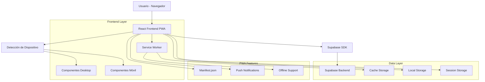
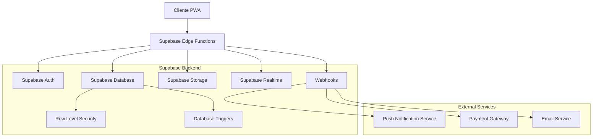
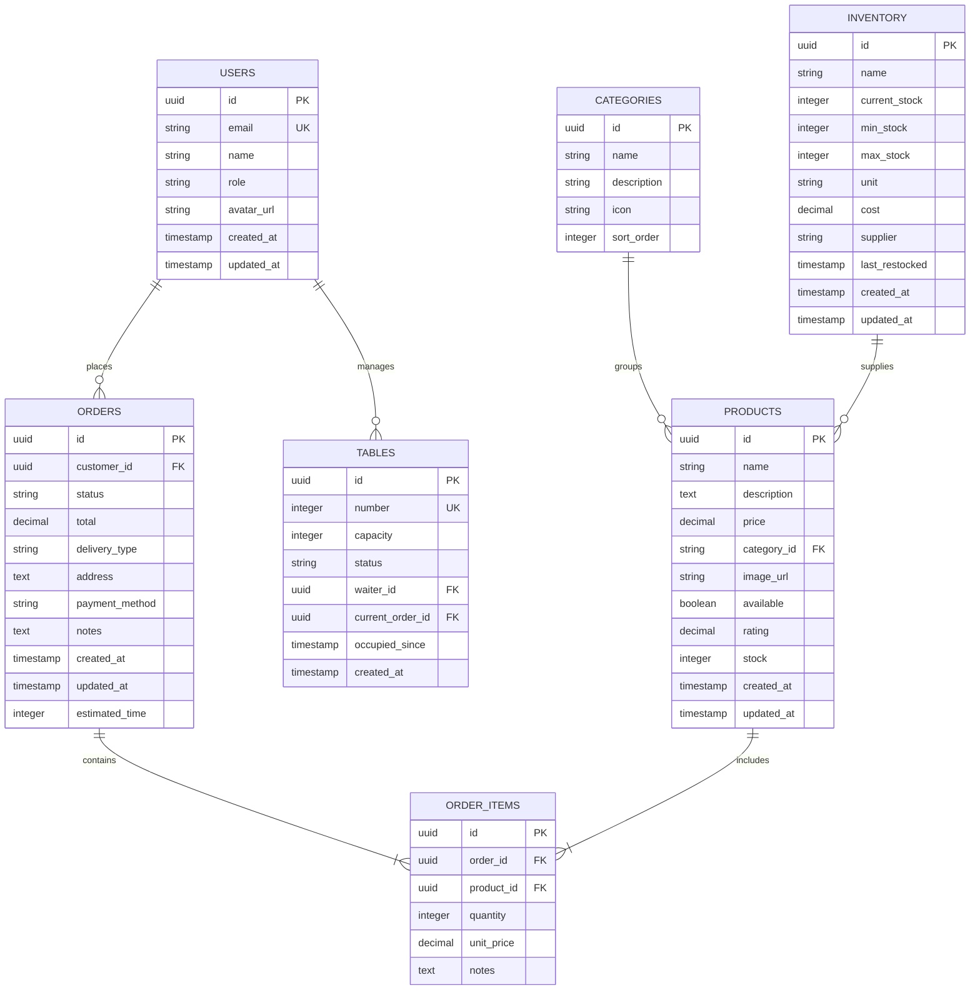

# 🥖 PAMBAZO - Arquitectura Técnica

## 1. Diseño de Arquitectura



## 2. Descripción de Tecnologías

- **Frontend**: React@18 + TypeScript + Vite + Tailwind CSS@3 + shadcn/ui
- **Backend**: Supabase (PostgreSQL + Auth + Storage + Real-time)
- **PWA**: Service Worker (Vite PWA Plugin) + Web App Manifest
- **Estado**: Zustand para gestión de estado global
- **Routing**: React Router v6 con lazy loading
- **UI Components**: 40+ componentes basados en shadcn/ui
- **Styling**: Tailwind CSS con variables CSS para theming
- **Icons**: Lucide React para iconografía consistente

## 3. Definiciones de Rutas

| Ruta | Propósito |
|------|----------|
| / | Página de login con detección automática de dispositivo |
| /customer | Dashboard del cliente (desktop) |
| /customer/mobile | Dashboard del cliente (móvil) |
| /waiter | Dashboard del mesero (desktop) |
| /waiter/mobile | Dashboard del mesero (móvil) |
| /admin | Dashboard del administrador (desktop) |
| /admin/mobile | Dashboard del administrador (móvil) |
| /owner | Dashboard del propietario (desktop) |
| /owner/mobile | Dashboard del propietario (móvil) |
| /catalog | Catálogo de productos público |
| /order/:id | Seguimiento de pedido específico |
| /install | Página de instalación PWA |

## 4. Definiciones de API

### 4.1 API Principal

**Autenticación de Usuario**
```
POST /auth/login
```

Request:
| Parámetro | Tipo | Requerido | Descripción |
|-----------|------|-----------|-------------|
| email | string | true | Email del usuario |
| password | string | true | Contraseña |
| role | string | true | Rol: customer, waiter, admin, owner |

Response:
| Parámetro | Tipo | Descripción |
|-----------|------|-------------|
| success | boolean | Estado de la autenticación |
| user | object | Datos del usuario autenticado |
| token | string | Token de sesión |

**Gestión de Productos**
```
GET /api/products
POST /api/products
PUT /api/products/:id
DELETE /api/products/:id
```

**Gestión de Pedidos**
```
GET /api/orders
POST /api/orders
PUT /api/orders/:id/status
GET /api/orders/:id
```

**Gestión de Inventario**
```
GET /api/inventory
POST /api/inventory/restock
PUT /api/inventory/:id
GET /api/inventory/alerts
```

**Analytics y Métricas**
```
GET /api/analytics/sales
GET /api/analytics/products
GET /api/analytics/performance
```

### 4.2 Tipos TypeScript Compartidos

```typescript
// Tipos de Usuario
interface User {
  id: string;
  email: string;
  name: string;
  role: 'customer' | 'waiter' | 'admin' | 'owner';
  avatar?: string;
  createdAt: Date;
}

// Tipos de Producto
interface Product {
  id: string;
  name: string;
  description: string;
  price: number;
  category: string;
  image?: string;
  available: boolean;
  rating: number;
  stock: number;
}

// Tipos de Pedido
interface Order {
  id: string;
  customerId: string;
  items: OrderItem[];
  status: 'pending' | 'preparing' | 'ready' | 'delivered' | 'cancelled';
  total: number;
  deliveryType: 'pickup' | 'delivery';
  address?: string;
  paymentMethod: 'cash' | 'card';
  notes?: string;
  createdAt: Date;
  estimatedTime?: number;
}

// Tipos de Mesa
interface Table {
  id: string;
  number: number;
  capacity: number;
  status: 'available' | 'occupied' | 'reserved' | 'cleaning';
  waiterId?: string;
  currentOrder?: string;
  occupiedSince?: Date;
}

// Tipos de Inventario
interface InventoryItem {
  id: string;
  name: string;
  currentStock: number;
  minStock: number;
  maxStock: number;
  unit: string;
  cost: number;
  supplier?: string;
  lastRestocked: Date;
}
```

## 5. Arquitectura del Servidor



## 6. Modelo de Datos

### 6.1 Definición del Modelo de Datos



### 6.2 Lenguaje de Definición de Datos

**Tabla de Usuarios (users)**
```sql
-- Crear tabla de usuarios
CREATE TABLE users (
    id UUID PRIMARY KEY DEFAULT gen_random_uuid(),
    email VARCHAR(255) UNIQUE NOT NULL,
    name VARCHAR(100) NOT NULL,
    role VARCHAR(20) NOT NULL CHECK (role IN ('customer', 'waiter', 'admin', 'owner')),
    avatar_url TEXT,
    created_at TIMESTAMP WITH TIME ZONE DEFAULT NOW(),
    updated_at TIMESTAMP WITH TIME ZONE DEFAULT NOW()
);

-- Crear índices
CREATE INDEX idx_users_email ON users(email);
CREATE INDEX idx_users_role ON users(role);

-- Políticas RLS
ALTER TABLE users ENABLE ROW LEVEL SECURITY;
GRANT SELECT ON users TO anon;
GRANT ALL PRIVILEGES ON users TO authenticated;
```

**Tabla de Productos (products)**
```sql
-- Crear tabla de productos
CREATE TABLE products (
    id UUID PRIMARY KEY DEFAULT gen_random_uuid(),
    name VARCHAR(200) NOT NULL,
    description TEXT,
    price DECIMAL(10,2) NOT NULL,
    category_id UUID REFERENCES categories(id),
    image_url TEXT,
    available BOOLEAN DEFAULT true,
    rating DECIMAL(3,2) DEFAULT 0,
    stock INTEGER DEFAULT 0,
    created_at TIMESTAMP WITH TIME ZONE DEFAULT NOW(),
    updated_at TIMESTAMP WITH TIME ZONE DEFAULT NOW()
);

-- Crear índices
CREATE INDEX idx_products_category ON products(category_id);
CREATE INDEX idx_products_available ON products(available);
CREATE INDEX idx_products_rating ON products(rating DESC);

-- Políticas RLS
ALTER TABLE products ENABLE ROW LEVEL SECURITY;
GRANT SELECT ON products TO anon;
GRANT ALL PRIVILEGES ON products TO authenticated;
```

**Tabla de Pedidos (orders)**
```sql
-- Crear tabla de pedidos
CREATE TABLE orders (
    id UUID PRIMARY KEY DEFAULT gen_random_uuid(),
    customer_id UUID REFERENCES users(id),
    status VARCHAR(20) DEFAULT 'pending' CHECK (status IN ('pending', 'preparing', 'ready', 'delivered', 'cancelled')),
    total DECIMAL(10,2) NOT NULL,
    delivery_type VARCHAR(20) NOT NULL CHECK (delivery_type IN ('pickup', 'delivery')),
    address TEXT,
    payment_method VARCHAR(20) NOT NULL CHECK (payment_method IN ('cash', 'card')),
    notes TEXT,
    estimated_time INTEGER,
    created_at TIMESTAMP WITH TIME ZONE DEFAULT NOW(),
    updated_at TIMESTAMP WITH TIME ZONE DEFAULT NOW()
);

-- Crear índices
CREATE INDEX idx_orders_customer ON orders(customer_id);
CREATE INDEX idx_orders_status ON orders(status);
CREATE INDEX idx_orders_created_at ON orders(created_at DESC);

-- Políticas RLS
ALTER TABLE orders ENABLE ROW LEVEL SECURITY;
GRANT SELECT ON orders TO anon;
GRANT ALL PRIVILEGES ON orders TO authenticated;
```

**Datos Iniciales**
```sql
-- Insertar categorías iniciales
INSERT INTO categories (name, description, icon, sort_order) VALUES
('Panes', 'Panes frescos artesanales', '🍞', 1),
('Pasteles', 'Pasteles y tortas especiales', '🎂', 2),
('Galletas', 'Galletas caseras variadas', '🍪', 3),
('Bebidas', 'Bebidas calientes y frías', '☕', 4);

-- Insertar productos de ejemplo
INSERT INTO products (name, description, price, category_id, available, rating, stock) VALUES
('Pan Integral', 'Pan integral con semillas', 3500, (SELECT id FROM categories WHERE name = 'Panes'), true, 4.5, 20),
('Croissant', 'Croissant francés mantequilloso', 2800, (SELECT id FROM categories WHERE name = 'Panes'), true, 4.8, 15),
('Torta Chocolate', 'Torta de chocolate con crema', 25000, (SELECT id FROM categories WHERE name = 'Pasteles'), true, 4.9, 5),
('Galletas Avena', 'Galletas de avena con pasas', 1500, (SELECT id FROM categories WHERE name = 'Galletas'), true, 4.3, 30);

-- Insertar mesas iniciales
INSERT INTO tables (number, capacity, status) VALUES
(1, 2, 'available'),
(2, 4, 'available'),
(3, 2, 'available'),
(4, 6, 'available'),
(5, 4, 'available'),
(6, 2, 'available'),
(7, 4, 'available'),
(8, 8, 'available');
```